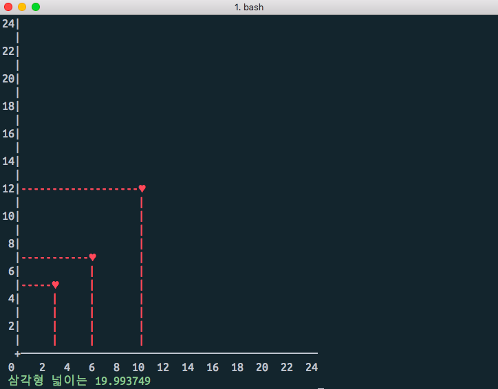
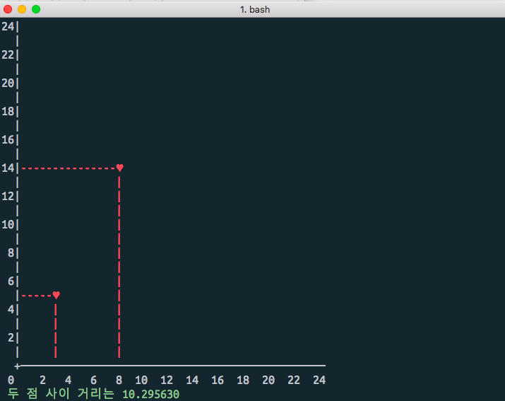

## 좌표계산기 요구사항

### 시작하기

>- 점,선,삼각형,사각형 관련 계산기를 구현하기 전에 좌표축을 그린다.
>- 단계별로 각 요구사항에 따라서 기능을 추가한다.
>- 단계별로 화면에 결과를 표시하도록 개선한다.

### 좌표 입력과 출력

>- 좌표 정보는 괄호"(", ")"로 둘러쌓여 있으며 쉼표(,)로 x값과 y값을 구분한다.
>- X, Y좌표 모두 최대 24까지만 입력할 수 있다.
>- 입력 범위를 초과할 경우 에러 문구를 출력하고 다시 입력을 받는다.
>- 정상적인 좌표값을 입력한 경우, 해당 좌표에 특수문자를 표시한다.

### 화면 처리 유의사항

>- 터미널 화면은 뒤집힌 1사분면으로 동작한다. 위쪽이 0이고 아래로 내려올수록 커진다.
>- X좌표축은 화면 비율상 2를 곱해서 표현해야 한다.
>- X좌표축 범례는 Y축으로 25만큼 떨어진 공간에 그려진다.
>- Y좌표축은 터미널 좌표상 3만큼 떨어져서 그려진다.

### 직선 입력과 출력

>- 좌표값을 두 개 입력한 경우, 두 점을 있는 직선으로 가정한다. 좌표값과 좌표값 사이는 '-' 문자로 구분한다.
>- 직선인 경우는 두 점 사이 거리를 계산해서 출력한다.
>- InputView 구조체에서 입력가능한 CharacterSet을 만들어서 입력된 문자열 중에 입력할 수 없는 문자가 포함되어 있는지 비교한다. 입력 불가능한 문자가 포함된 경우 다시 입력받는다.
>- 입력받은 두 개의 좌표값 정보를 처리하기 위한 MyLine 구조체를 구현한다.

### 삼각형 입력과 출력

>- MyTriangle 구조체 인스턴스를 OutputView에 넘겨서 세 점을 출력하는 함수를 추가한다.
>- MyTriangle 구조체에는 세 점으로 삼각형의 넓이를 계산하는 함수를 구현한다.

### 사각형 입력과 출력

>- 좌표값을 네 개 입력한 경우, 네 점을 연결하는 사각형으로 가정한다.
>- 네 점이 뒤틀어진 사다리꼴이나 마름모는 제외하고 직사각형만 허용하도록 검사한다.
>- 사각형인 경우 사각형의 넓이를 계산해서 출력한다.

 

- **문제점**: Any, AnyObject 타입은 왠만하면 쓰지 않는 것이 좋다. swift가 타입에 엄격한 특징이 있기 때문 —> protocol이나 generic 구조로 일반화시켜보자.
- protocol에 선언한 함수를 가져다 쓸 때는 private 접근자를 쓰지 못한다. 대신, 내부 접근자인 internal 접근자를 쓴다.
- return type이 제네릭 타입인 경우, 한 함수에 여러 리턴 타입이 있으면 ‘as! T’를 붙여준다. 하지만 제네릭 타입은 들어오는 모든 타입이 동일하게 동작하는 경우에 사용하는 것이 좋다.
- **해결방법**: MyPoint, MyLine, MyTriangle가 동시에 준수하는 프로토콜 타입을 리턴타입으로 사용.
- **유닛테스트 문제점**: Module ‘~~’ was not compiled for testing
- **해결방법**: swift package manager를 썼기 때문에 @testable import CoordinateCalculator 를 선언할 필요가 없었다. (같은 모듈로 취급하기 때문인 듯하다)

